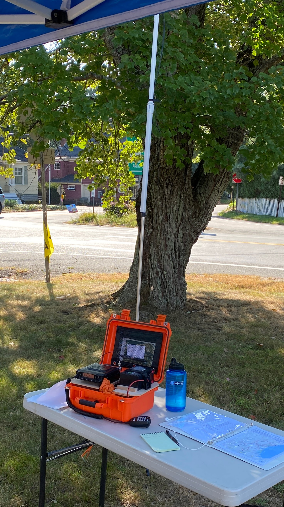

## At home

My primary radio is a [Kenwood TM-V71A], attached via a [Digirig] to a Raspberry Pi for packet operation. I have a [Yaesu FT-891] that I use occasionally for [POTA] activations.

[kenwood tm-v71a]: https://www.kenwood.com/usa/com/amateur/tm-v71a/
[digirig]: https://digirig.net/store/
[yaesu ft-891]: https://www.yaesu.com/product-detail.aspx?Model=FT-891&CatName=HF%20Transceivers/Amplifiers
[pota]: https://parksontheair.com/index.html

## In the field

My typical setup for public service events is a Kenwood TM-V71A in my van configured as a repeater, while I wear an HT (with a [very small antenna](https://a.co/d/4bKmNXh)) on my chest. If I need to use the mobile radio and I can't use the van (either I'm stationed somewhere that I can't park, or if I bike to the event) I will use either:

- an [Ed Fong DBJ-2](https://edsantennas.weebly.com/) roll-up antenna, either strung up in a tree or mounted on a tripod and a PVC mast, or
- a tripod-mounted [Signal Staff](https://signalstuff.com/products/ss-osj/) collapsible opejn-stub j-pole antenna

## HTs

At events for which an HT is appropriate, I use a Radioddity [GD-77] running [OpenGD77] firmware. My "event kit" looks something like this:

- [Radioddity GD-77][gd-77]
- Spare battery
- [Signal Stick antenna][signalstick]
- [Commountain speaker mic]
- [Signal stick magnetic mount][magmount]
- [Battery eliminator]
- [Commountain earpiece]

I have two complete kits so that there's a backup of everything if something goes wrong.

[gd-77]: https://www.radioddity.com/products/radioddity-gd-77-dmr-two-way-radio
[opengd77]: https://www.opengd77.com/
[signalstick]: https://signalstuff.com/products/st-bnc/
[magmount]: https://signalstuff.com/products/magmount-bnc/
[commountain speaker mic]: https://a.co/d/47TXEOT
[battery eliminator]: https://a.co/d/59CWsIM
[commountain earpiece]: https://a.co/d/hoNMBbq
