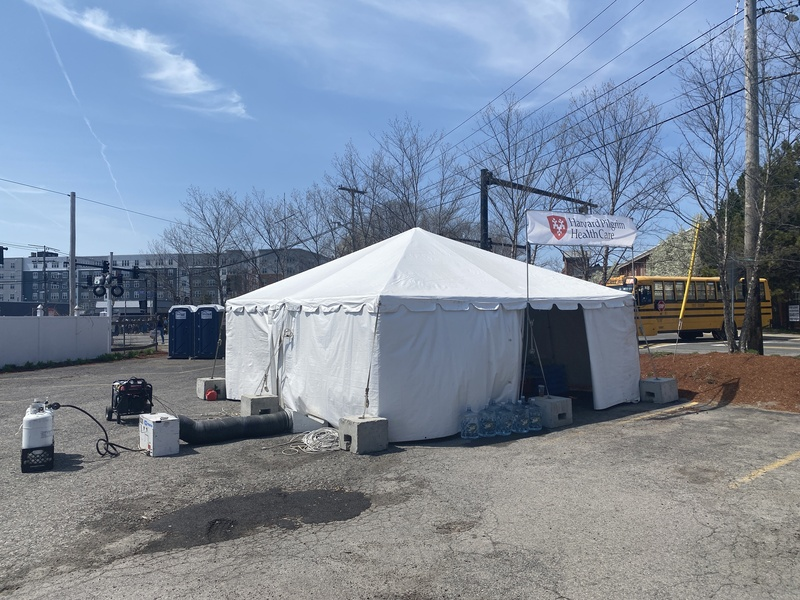

This was my first year volunteering at the Boston Marathon. The Boston Marathon is one of the largest amateur radio service opportunities in the area. There were close to 300 amateur radio volunteers helping out this year. I was stationed at Med tent 3, at mile 7, which is right at the intersection of Bishop St. and Waverley St. in Framingham (you can see [my map] of the marathon showing all the water stops, medical tents, etc).

[my map]: https://www.google.com/maps/d/u/0/edit?mid=1Ljv1p6dRHARUxZPiSQDZWUojn-v0lwo&usp=sharing

---

Going into this event, I was a little unsure about what exactly I would be able to bring -- the official materials are filled with information about restrictions (No backpacks! Only bring what you can wear!), but in the end it turned out I didn't need to worry: I was able to drive my minivan right up to the medical tent. I could have shown up in a communication support van sprouting multiple antennas and with my very own generator and nobody would have blinked an eye. I'm sure security is more strict near the beginning and end of the course!

You can see my photos of the event [here](https://photos.app.goo.gl/3bUNUqvNvxf76FWr8).

