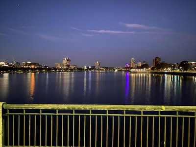
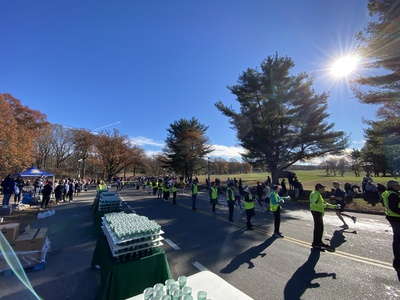

Up at 4:30 in the morning for a 5am bike ride from Belmont to Franklin Park. It was a chilly 30°F when I left, but warmed up later in the day. I was at water station 7, just outside the start/finish line. Other than checking in, checking out, and roll call, there wasn't much to do on the radio so I spent my time helping the water volunteers fill cups, clean up, etc.

---

You can find some pictures from the event [here](https://photos.app.goo.gl/oQaxifhZ3dft7wwy6).

