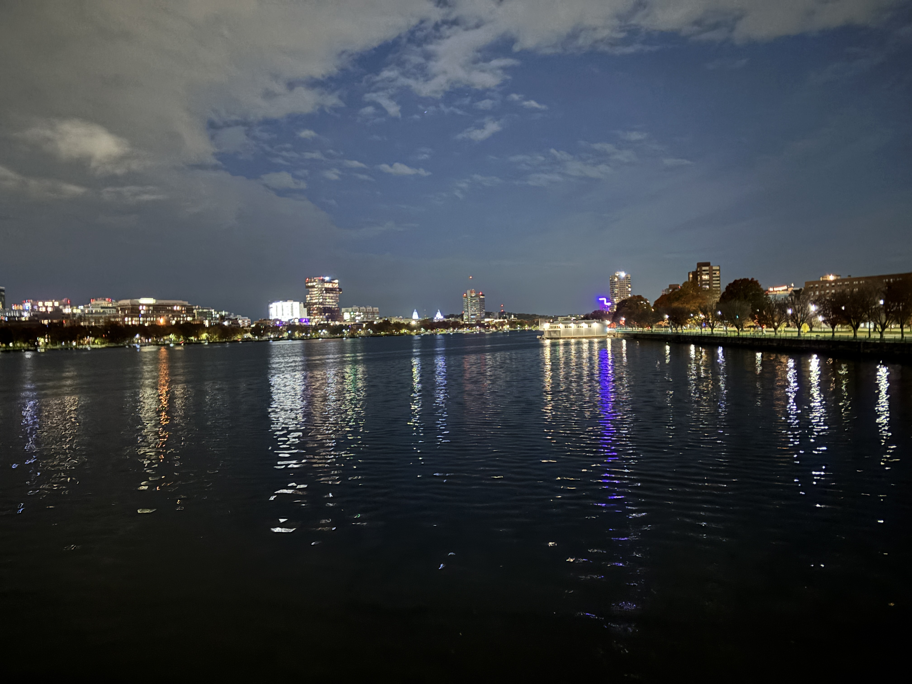
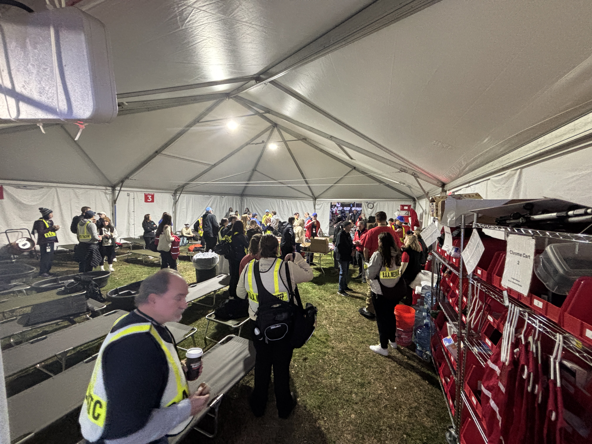

Another year of waking up at 4:30AM and biking into Boston! This year I was stationed at [water stop 5], on Jamaicaway just north of Craftson Way. I met up with the rest of the volunteers at the main medical tent in Franklin Park, and then after our briefing biked the three miles from Franklin Park to the station. Once there, I met up with the water stop crew from [Shamrock Running Club] of Woburn. We lucked out with the weather; it was warmer than expected when I left the house (maybe 50°F), and during the race it was mostly sunny and approaching 60°F towards the end.

[shamrock running club]: https://www.shamrockrunningclub.com/
[water stop 5]: https://maps.app.goo.gl/KNoLumpHPhmsfXSJ6

---

We had some logistical challenges this year: BPD was slow closing down the roads, which meant that standing in the road while setting up the water stop was a hair-raising experience. It also seems as if many of the portable toilets were still zip-tied shut after the race started; I had a multi tool so we took care of ours, but several other stations called in reporting the problem. There was also some confusion about exactly where the last participant was, but I think that was ultimately sorted out.

I spent much of my time assisting with the cleanup: raking cups into piles, shoveling piles of cups into trash cans, and slinging around trash bags full of cups all while close to 9,000 ran by. I got in my steps and my exercise for the day!

## Documents and maps

- [Assignments](2025%20Boston%20Half%20Assignments%20Nov06.pdf)
- [ICS 205](2025%20BAA%20Half%20Marathon%20-%20ICS%20205%20Channel%20Plan.pdf) (channel plan)
- [Course map](https://www.google.com/maps/d/u/0/viewer?hl=en&ll=42.30706866367039%2C-71.09056282303659&z=17&mid=1svMYuhDJG0GS_hQKzz__QbesG9XOK3g)

<iframe src="https://www.google.com/maps/d/embed?mid=1svMYuhDJG0GS_hQKzz__QbesG9XOK3g&hl=en&ehbc=2E312F" width="640" height="480"></iframe>

## Photos

