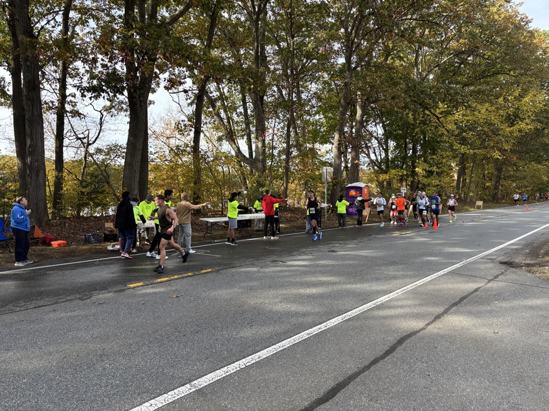

This is my second year working at the Baystate marathon. It looks like they're expecting just about 2500 runners this year. Last year I was stationed at one of the medical tents at the Tsongas center. This year I was stationed out on the course at [water stop #6](https://maps.app.goo.gl/68SApMVMaqHZgn5d8), along the Merrimack River and across from American Legion post 247 in Tyngsborough. We were accompanied by groups of student volunteers from the Tyngsborough HS cross country team, the Lowell HS National Honor Society, and possibly one other group.

---

The day started bit chilly but it was 70°F by the end of the race around 1pm. I helped out the water stop volunteers by cleaning up cups dropped by the runners. There's a lot of trash on the ground between the road and the river; I tried to pick up as much as I could while I was there. I asked the coach if I could borrow his team for more cleanup while we were waiting for the race to start, but he wasn't into that idea. It would be a great community service project for a scout troop!

## Documents

- [Baystate Marathon Runner Accountability Doc](Baystate%20Marathon%20Runner%20Accountability%20Doc.pdf)
- [Course map and description](https://www.baystatemarathon.com/course-map-description)
- [Garmin course](https://connect.garmin.com/modern/course/128993260)
- [Assignments](assignments)
- [Incident radio communication plan (ICS 205)](ICS205.pdf)
- [Water stop teams & coaches](waterstops)

## Radio frequencies

| Name          | Frequency | Offset   | CTCSS | Description                            |
| ------------- | --------- | -------- | ----- | -------------------------------------- |
| BAYSTATE 1    | 147.495   | SIMPLEX  | 74.4  | Water stop/course, NCS and Family Info |
| BAYSTATE 2    | 147.525   | SIMPLEX  | 74.4  | Tsongas Circle units                   |
| PRE/POST RACE | 146.955   | -600 KHz | 74.4  | WESTFORD MA [WB1GOF] repeater          |

[WB1GOF]: https://wb1gof.org/
