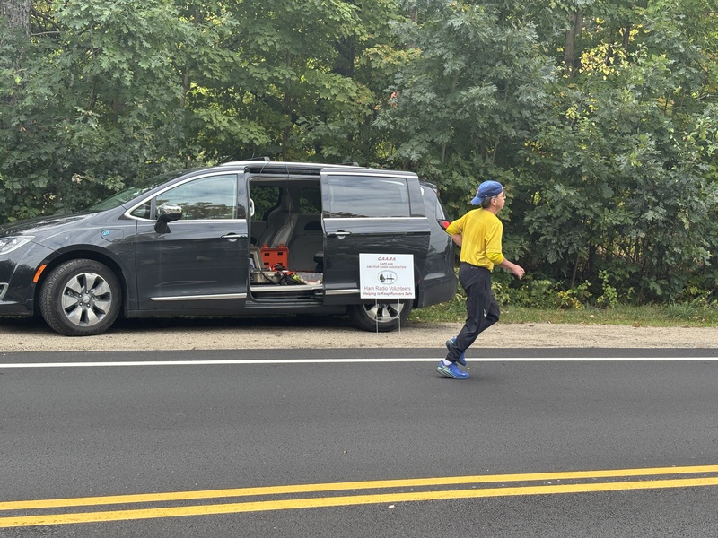

I was stationed at checkpoint 5 near the intersection of [Chebacco Rd. and Essex St.][cp5] I have put together a [course map with checkpoint locations]. This wasn't as scenic as some other locations; Essex St. is relatively busy. Joe the Hamilton police officer closed down one side of the road to help keep runners safe.

[cp5]: https://maps.app.goo.gl/XohjdGkp6Ht5Fnts6
[course map with checkpoint locations]: https://www.google.com/maps/d/u/0/edit?mid=1wLR6LiAV4j4Z8B59hmeJU-A3NpiD65M&usp=sharing

---

- [Checkpoint locations](checkpoints.pdf)
- [Course map with mile markers](map-with-mile-markers.pdf)

