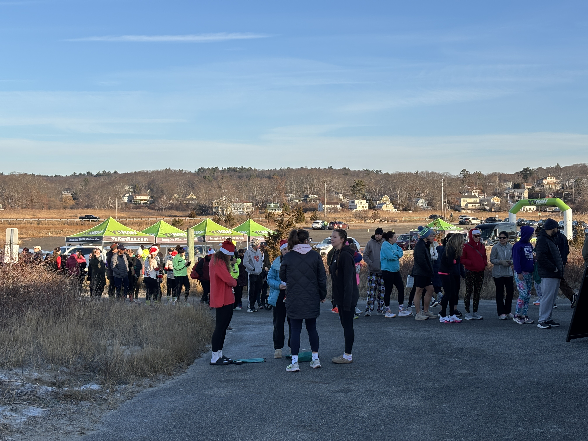
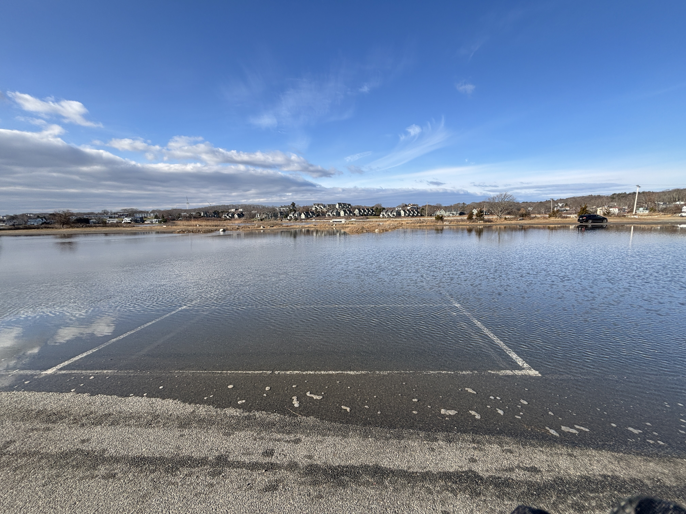

The Happy Holidays Half Marathon (aka Merrithon) is the last half marathon of the season supported by [CAARA]. For this event, rather than serving at one of the checkjpoints I was shadowing Fred WA1ESU at Net Control. I am planning on acting as net control for some of the races next year; the plan is to try to rotate several folks through the position so that we have multiple people with appropriate experience.

[caara]: https://caara.net/

---

We lucked out with the weather; it was sunny and mild for a December day.

There was a higher than usual tide today, and we were fortunate with the timing: high tide was at 12:30, and the race ended at noon. This was the parking lot about 20 minutes after the end of the race:

You can find more photos from the event [here](https://photos.app.goo.gl/hujyUQTYHthYRAga8).

The maps provided by YuKanRun aren't great, so I spent some quality time with [QGIS] to create a [custom map] of the course. I'm planning on doing this for all the half marathons going forward.

[custom map]: caara-happy-holidays-2025.pdf
[qgis]: https://qgis.org/

Since I was actively monitoring a checkpoint, I kept a communications log for the event which you can find [here](commslog.pdf).
