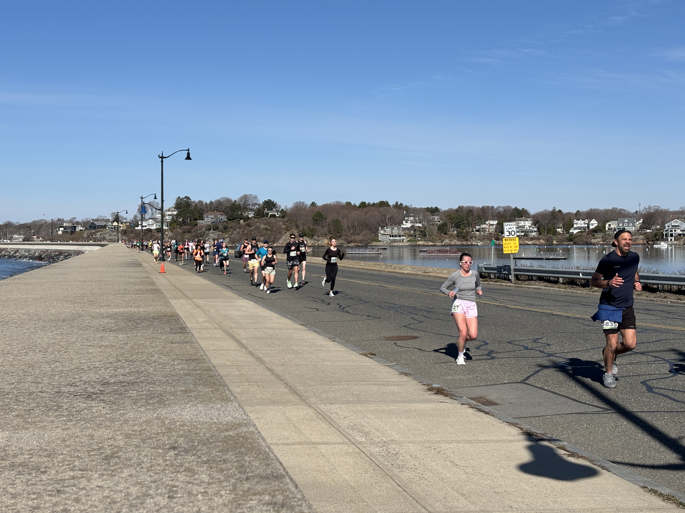
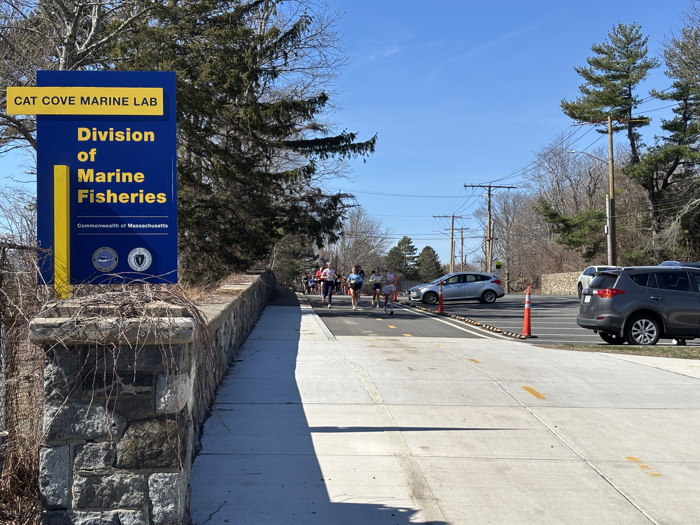

Today was a lovely day for a race, with lots of sun and highs near 60°F. I started a [checkpoint 1](https://www.google.com/maps/search/?api=1&query=42.491789%2C%20-70.847104), but since we didn't have full coverage for the race I relocated to [checkpoint 5](https://www.google.com/maps/search/?api=1&query=Memorial%20Dr%20%26%20Fort%20Ave%2C%20Salem%2C%20MA) after the lead runner passed by for the second time.

---

Checkpoint 5 has lots of parking, and is located right at the base of the Fort Lee area. I hiked ("walked") up to the top of the hill and watched for the lead running from there before returning to the course.

Runners on the causeway approaching checkpoint 1:

Looking down at the course from the hills of Fort Lee:

Runners passing checkpoint 5:

