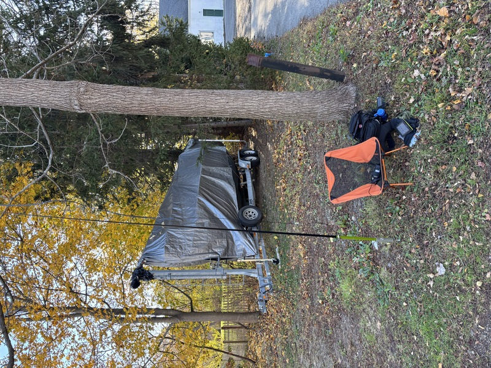

The Ocean View Half Marathon runs through Ipswich and around Great Neck. This year I was stationed at [checkpoint 3], at the intersection of East St & Jeffrey's Neck Rd. This was a particularly interesting experience, because I was without a car. I was fortunate to get a ride there from Steve [K8ZBE] (who fortuitously lives nearby, and it turns out that we also both play in the community band!), but I had to pack everything with me rather than relying on my car for storage. It also meant my trip home was a bit longer, since it involved walking from my station to the Ipswich commuter rail stop (about a mile), and then taking public transit home.

[checkpoint 3]: https://maps.app.goo.gl/RZVKvosdmVfnPddA9
[K8ZBE]: https://www.qrz.com/db/K8ZBE

---

I recently acquired [a new backpack], and it turned out to be just the thing. In this picture, you can see the backpack, my camping chair, and if you squint you can see a portable j-pole on a telescoping mast. I set that up because initially it seemed like there might be some issues reaching net control, but that turned out to be due to equipment difficulties on the NC side, so I eventually took down the mast and switched back to a [SignalStick] antenna on the HT.

[a new backpack]: https://www.511tactical.com/all-hazards-nitro-backpack.html
[signalstick]: https://signalstuff.com/products/st-bnc/

## Documents

- [Assignments](assignments)

<iframe src="https://www.google.com/maps/d/u/0/embed?mid=1iB1ilV21pi3AofbDyXTXK9UPMFHpzOQ&ehbc=2E312F" width="640" height="480"></iframe>
