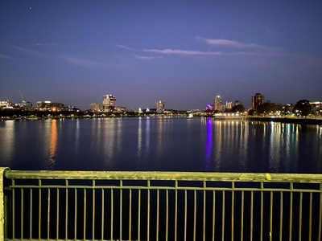
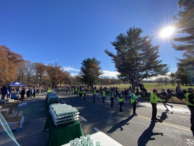
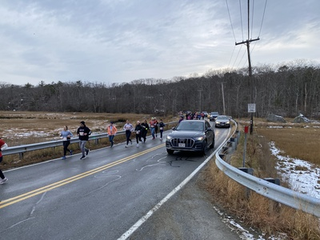

## My volunteer activities

- September 2024 [Cycle for
  Shelter](https://give.emmausinc.org/event/2024-cycle-for-shelter/e570321).

  I was stationed at the [Boxford Second Congregational Church][boxford]. You can see a few photos of my station
  [here](https://photos.app.goo.gl/BknbK9RmPYQ6ZwGP6). I've put together a map of the courses and rest stops [here](https://www.google.com/maps/d/edit?mid=1AVcfy-LazXzyhn2wXhymyljLHbaF0zA&usp=sharing).

  [boxford]: https://maps.app.goo.gl/XeGoP6vEKsBJMwGW8

- October 2024 [Baystate Marathon][baystate]

  I was stationed at medical tent 1A along with Tim Carter [K1DC]. Our job was to record the bib numbers of runners coming in for medical care so that we could provide those to the family info table if someone dropped by looking for their people.

  [k1dc]: https://www.qrz.com/db/K1DC

- November 2024 [BAA Half Marathon][baahalf]

  Up at 4:30 in the morning for a 5am bike ride from Belmont to Franklin Park. It was a chilly 30°F when I left, but warmed up later in the day. I was at water station 7, just outside the start/finish line. Other than checking in, checking out, and roll call, there wasn't much to do on the radio so I spent my time helping the water volunteers fill cups, clean up, etc. 

  You can find some pictures from the event [here](https://photos.app.goo.gl/oQaxifhZ3dft7wwy6).

  

  

- December 2024 [Happy Holidays Half Marathon][hhh]

  I was stationed at Checkpoint 1, the intersection of Thatcher Rd and Farm Lane (some sort of private drive).

  It's a good thing I packed my TM-V71A, because I was just a bit too far away from the repeater for the HT. I set up the mobile as a cross-band repeater and it worked great.

  You can find some pictures from the event [here](https://photos.google.com/album/AF1QipOdTIKuRMeSPWXmk9raMrLtjzntuqLiUOIQNPTQ).

  

## Public service opportunities

The following events have in the past asked for the help of amateur radio volunteers. Announcements are often made to the various club mailing lists when an event is actively looking for volunteer assistance.

- [BAA Boston Marathon][baa] in April

- [Cycle for Shelter](https://emmausinc.org/cycle-for-shelter-2/) in September

- [Baystate marathon][baystate] in October

  I have collected some information [here](baystate_marathon) for volunteers at the Baystate Marathon. Much of this material originated with Terry M. Stader, [KA8SCP], who helps organize amateur radio volunteer service at this event.

- [BAA Half Marathon][baahalf] in November
 
  I have collected some information about the BAA Half Marathon [here](baa_half_marathon).

- [Ocean View Half Marathon](https://www.yukanrun.com/oceanview-half-marathon-5k) in November (volunteer radio service organized by [CAARA])

- [Happy Holidays Half Marathon][hhh] in December (volunteer radio service organized by [CAARA])

  I have collected some information [here](happy_holidays_half_marathon) for amateur radio volunteers.

[baa]: https://www.baa.org/races/boston-marathon/volunteer
[baystate]: https://www.baystatemarathon.com/
[baahalf]: https://www.baa.org/races/boston-half
[ka8scp]: http://ka8scp.wb1gof.net/
[hhh]: https://www.yukanrun.com/happy-holidays-half-merrython-5k

### More information on opportunities

- The [Boston Amateur Radio Club public service page](https://www.barc.org/public-service/)
- The [ARRL volunteer opportunities](http://www.arrl.org/volunteer-opportunities) page
- [Cape Anne Amateur Radio Race Support and Public Service][caara]
- The [Eastern Massachusetts ARRL](https://ema.arrl.org/) website sometimes has information about upcoming volunteer opportunities

[caara]: https://sites.google.com/view/caararaces/home
## Articles and documentation about amateur radio public service

- [Ham Radio Boston](https://www.hamradioboston.org/), organizes amateur radio volunteers for the Boston Marathon. See in particular the [Docs & Videos](https://www.hamradioboston.org/docs-videos) section.
- [Public service packing checklist](https://ag6qr.net/index.php/public-service-packing-checklist/) from AG6QR
- [Public service operating guidelines](https://ag6qr.net/index.php/public-service-operating-guidelines/) from AG6QR
- [HAM Radio Communications Can Support Public Events](https://k6mpn.org/training/resources/2019OctPublic%20Events%20Support_2.pdf) from K6MPN
- [Amateur Radio Operator's Public Service Guide](https://laarc.weebly.com/uploads/7/3/2/9/73292865/guidlines_for_community_events.pdf) by NM5CR at the [Los Alamos Amateur Radio Club](https://laarc.weebly.com)
- [How to be a ham radio operator during public service events and nets](https://youtu.be/HHxNOMGSwAI?si=hQ7T_-v_ZJ-z-1Cy) by the [Marin Amateur Radio Society](https://www.w6sg.net/)
